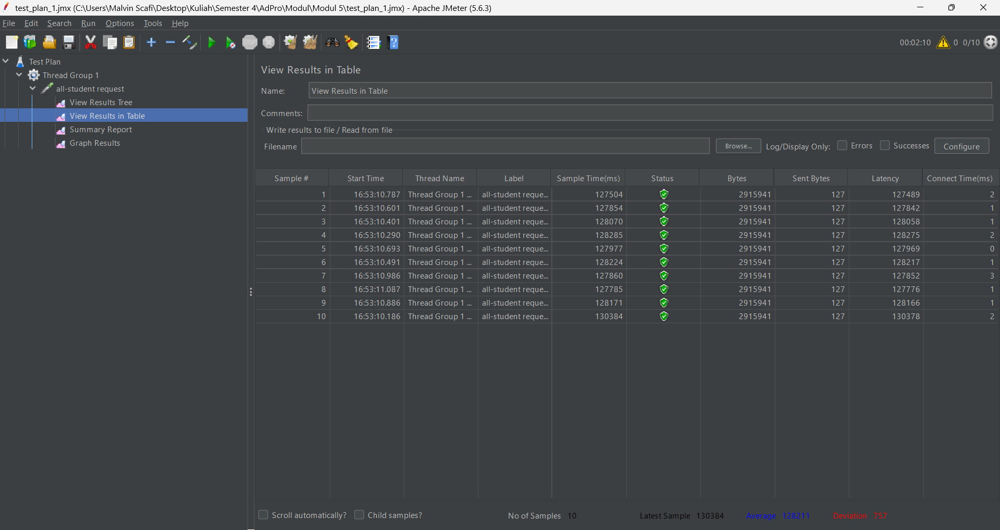
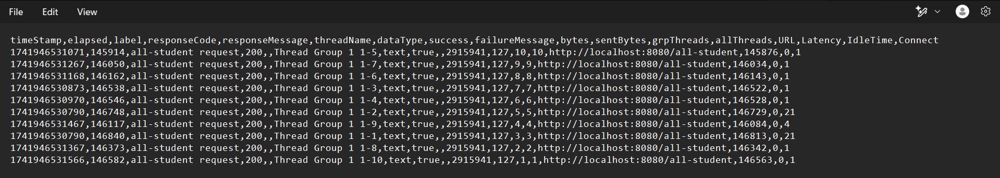
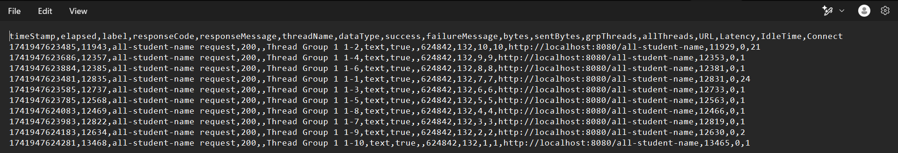
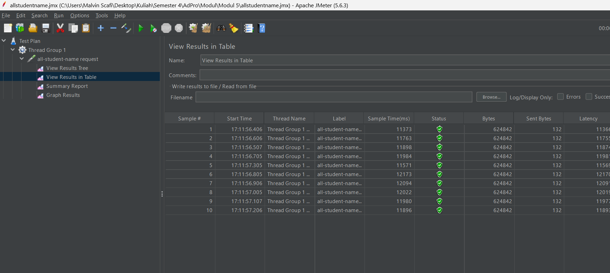
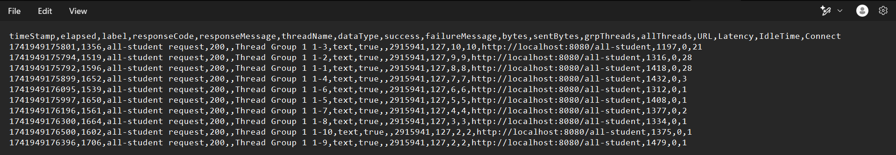
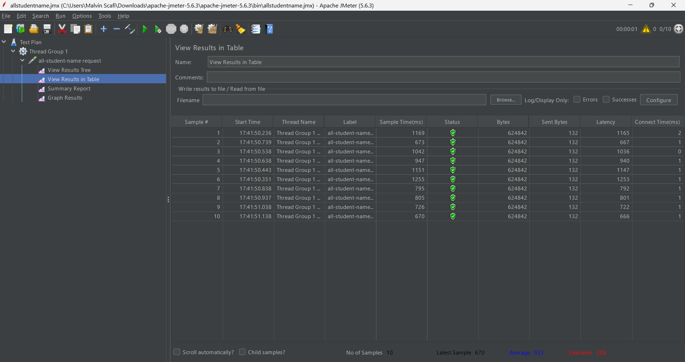
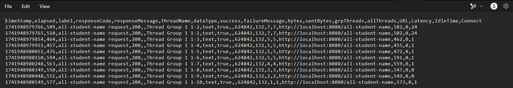
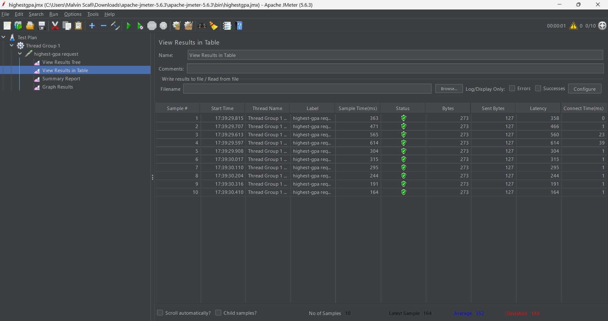
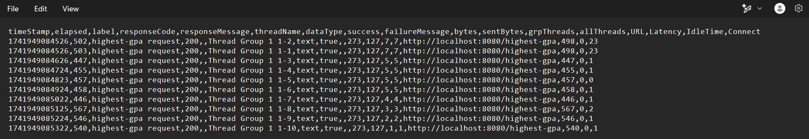

## JMeter Performance Test Results

### Sebelum Optimasi
#### `/all-student`

- **Waktu Maksimum:** 130,384 ms

#### `/all-student-name`

- **Waktu Maksimum:** 6,516 ms

#### `/highest-gpa`

- **Waktu Maksimum:** 907 ms

---

### Setelah Optimasi
#### `/all-student`

- **Waktu Maksimum:** 12,173 ms

#### `/all-student-name`

- **Waktu Maksimum:** 1,255 ms

#### `/highest-gpa`

- **Waktu Maksimum:** 614 ms

---

## Analisis dan Kesimpulan
Dari hasil pengujian sebelum dan setelah optimasi, terjadi penurunan signifikan dalam waktu maksimum yang dibutuhkan untuk masing-masing endpoint:

- **Endpoint `/all-student` mengalami peningkatan performa drastis**, dengan waktu maksimum berkurang dari **130,384 ms menjadi 12,173 ms** (sekitar **90.7% lebih cepat**).
- **Endpoint `/all-student-name` mengalami peningkatan performa signifikan**, dengan waktu maksimum turun dari **6,516 ms menjadi 1,255 ms** (sekitar **80.7% lebih cepat**).
- **Endpoint `/highest-gpa` mengalami peningkatan performa walaupun tidak mengalami penigkatan sejauh yang lainnya**, dengan waktu maksimum berkurang dari **907 ms menjadi 614 ms** (sekitar **32.3% lebih cepat**).

### Kesimpulan
Optimasi yang dilakukan berhasil meningkatkan performa sistem secara signifikan, terutama pada endpoint dengan beban data besar seperti `/all-student`. Hal ini menunjukkan bahwa perubahan yang diterapkan, seperti peningkatan efisiensi query, caching, atau perbaikan struktur database, memberikan dampak positif terhadap kecepatan respons server.

Profiling tools IntelliJ berperan penting dalam mengidentifikasi bottleneck seperti query tidak efisien dan alokasi memori berlebihan. Hasil peningkatan performa yang terukur melalui JMeter membuktikan bahwa optimasi berbasis insight dari profiling sangat efektif meningkatkan kinerja aplikasi. Kombinasi kedua alat ini memberikan pendekatan yang komprehensif dalam optimasi aplikasi, dimana profiling mengidentifikasi masalah di tingkat kode sementara JMeter memverifikasi dampak perubahannya.

---

## Reflection

## Reflection

### 1. What is the difference between the approach of performance testing with JMeter and profiling with IntelliJ Profiler in the context of optimizing application performance?
- Performance testing dengan JMeter berfokus pada pengujian performa dari sisi eksternal (pengguna), mengukur waktu respons, throughput, dan reliabilitas sistem secara keseluruhan. Sementara IntelliJ Profiler menganalisis aplikasi dari dalam (internal), memeriksa penggunaan CPU, memori, dan thread pada tingkat kode untuk menemukan bottleneck spesifik.

### 2. How does the profiling process help you in identifying and understanding the weak points in your application?
- Profiling membantu mengidentifikasi titik lemah dengan memberikan visualisasi penggunaan CPU dan memori secara real-time, menunjukkan method yang membutuhkan waktu eksekusi paling lama, mengidentifikasi alokasi objek berlebihan, dan menyoroti bottleneck yang tidak terlihat dari pengujian eksternal. Proses ini memungkinkan pengembang untuk fokus pada bagian kode yang paling membutuhkan optimasi.

### 3. Do you think IntelliJ Profiler is effective in assisting you to analyze and identify bottlenecks in your application code?
- Ya, IntelliJ Profiler sangat efektif karena menyediakan call tree yang detail, menampilkan waktu eksekusi method secara presisi, dan mengintegrasikan hasil profiling langsung dengan kode sumber. Fitur ini memudahkan identifikasi dan perbaikan bottleneck pada level kode tanpa perlu beralih antar aplikasi.

### 4. What are the main challenges you face when conducting performance testing and profiling, and how do you overcome these challenges?
- Tantangan utama meliputi interpretasi data profiling yang kompleks, menciptakan lingkungan pengujian yang realistis, dan memprioritaskan area optimasi. Tantangan ini diatasi dengan membuat baseline performa, melakukan pengujian secara iteratif, fokus pada area dengan dampak terbesar, dan menggunakan kombinasi alat untuk validasi silang hasil.

### 5. What are the main benefits you gain from using IntelliJ Profiler for profiling your application code?
- Manfaat utama meliputi integrasi langsung dengan IDE, visualisasi data yang mudah dipahami, kemampuan merekam snapshot performa untuk analisis mendalam, dukungan untuk berbagai jenis profiling (CPU, memory, thread), dan navigasi langsung dari hasil profiling ke source code yang memudahkan proses perbaikan.

### 6. How do you handle situations where the results from profiling with IntelliJ Profiler are not entirely consistent with findings from performance testing using JMeter?
- Saat menghadapi inkonsistensi, saya memverifikasi metrik yang tidak konsisten, memeriksa perbandingan kondisi pengujian, menggabungkan insight dari kedua alat untuk pemahaman komprehensif, melakukan pengujian tambahan dengan parameter berbeda, dan mempelajari dokumentasi untuk memahami perbedaan metodologi pengukuran.

### 7. What strategies do you implement in optimizing application code after analyzing results from performance testing and profiling? How do you ensure the changes you make do not affect the application's functionality?
- Setelah menganalisis hasil pengujian kinerja dan profiling, saya mengoptimalkan kode aplikasi dengan mengidentifikasi bottleneck dan merombak logika yang tidak efisien. Misalnya, mengganti konkatenasi string berulang dengan `Collectors.joining()` di Java untuk meningkatkan efisiensi memori. Saya memastikan fungsi aplikasi tetap berjalan dengan melakukan uji unit untuk memvalidasi output, uji kinerja menggunakan alat benchmarking seperti JMH, serta uji integrasi untuk memastikan stabilitas sistem.